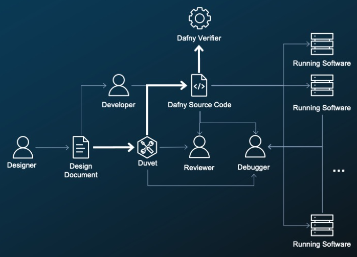

# How To Write More Correct Software

Welcome to the How To Write More Correct Software workshop!
You can skip right to [the workshop](./instructions/steps.md) if you like.

This content is currently a work in progress - use at your own risk, mind our dust, and stay tuned!

## To learn more

* [Dafny](http://dafny.org/), a programming language that formally verifies your implementation matches your specification
* [Duvet](https://github.com/awslabs/duvet), a code quality tool for measuring how well your human-readable specification is covered in code
* AWS Encryption SDK in Dafny: [https://github\.com/aws/aws\-encryption\-sdk\-dafny](https://github.com/aws/aws-encryption-sdk-dafny)
* s2n: [https://github\.com/aws/s2n\-tls](https://github.com/aws/s2n-tls)

## Why does code have to be correct?

If code is not correct it may not work.
In which case you risk blocked builds.
What if it is incorrect but everything still works?
This can be much worse.

Let's keep it positive.
Correct software improves

* Operations -
  Your software performs as you expect, more uptime.
* Evolution -
  You know what needs to change, faster development.
* Security -
  You can reason about security properties, better sleep.

## How hard can it be?

The problem with correctness is it is an external property.
You can read code, but you can not know by the code alone that it is correct.
Sure you have tests, but how do you know that your tests are correct?
How do you know that they are complete enough
to test all the facets of correctness you care about?
There are also a lot of people involved.
If you have multiple implementations of the same idea,
like the AWS Encryption SDK,
making sure that all these different implementations
do exactly the same thing is complicated.
You may not have the same project in multiple languages,
but you probably have multiple projects that interoperate.
They all need to agree on shared idea of correctness.

You need external information to judge if something is correct.
A design document is exactly what we need to define correctness!
We can all just read the doc right?

## Duvet

Reading the design doc is a great first step.
But reading it is not a mechanism to get every requirement implemented.
Duvet helps you "remember" the requirements in the doc.
It is a code quality tool to help bound correctness.
Duvet connects requirements from design docs to source and test code.

## How does Duvet work?

Duvet extracts requirements from text documents.
It will extract MUST/SHOULD (RFC2119 normative requirements) automatically.
It was originally built to handle RFCs,
but we are working to natively support Markdown.
Duvet helps you annotate your project
with these requirements as comments.
Duvet can then report on your project
and tell you what is complete, what is tested, what is left to do.

## Persona: Designer

For the designer writing the document,
Duvet is a mechanism to get requirements implemented and tested.
You sprinkle in `MUST` or `SHOULD` into your document,
and you can block the build until every requirement
not only has an implementation, but also a test.

## Persona: Developer

For the developer writing the implementation
Duvet maintains the punch list for you.
You can focus on getting the best implementation for a given requirement.
As you write the code you can ask:
Does this code satisfy this requirement?
Does this test verify this behavior?
If you need details,
the document is right there with all of the background
on _why_ these choices were made.

## Persona: Reviewer

For the reviewer reading the code
Duvet turns the design document into a map of the code.
As you review the code the details are right there for you.
You can jump right to the test and really focus on
"Does this test convince me that the requirement MUST be met?"

The reviewer can also update the design.
When Duvet is run on the new document,
the developer is now on the hook
to both implement and test these new requirements.

## Persona: Debugger

For the debugger coming to back to a project
that they have not worked on in a long time,
or are completely new to,
Duvet annotations create a network effect.
These annotations help give context to code,
especially if the code is not your preferred language.
They link back to the design document
to give background and more information.
Since these annotations are bidirectional,
they act as waypoints that let you move between
the more abstract design document
and the detailed implementation.

## When do you stop adding tests?

But now we are done right?
Every requirement has an implementation and a test.
They all have been reviewed.
Duvet can only see that you TRIED to test.
How does the reviewer know you tested ENOUGH?

Duvet is a mechanism to connect the requirement to the source,
but it leaves the quality and completeness of these links to humans.
A tests makes sure that something is true for one particular set of inputs,
it does not make sure that something is *always* true.
Todays edge case it tomorrow's issue.

## Dafny

Dafny is a *verification-aware* programming language.

Formal verification lets us translate the Duvet annotation
into a specification that says
"for every string in the *universe* this must **always** be true".
The Dafny verifier will use deductive reasoning to say "Yup, that is true".
This is like writing a test, but you are testing every value all at once
statically before you run any code.

Dafny uses formal logic to prove specifications.
It doesn't forget about edge cases
because it checks every case.

Since is very useful to have verified code,
but much more useful if you can run it,
Dafny compiles to many other languages:
Java, C#, JavaScript, Go, and more on the way!

Putting this together we have a strong chain
from the designer's intent right to what code is executing.

Now we have two mechanisms.
First Duvet makes us write a specification for every requirement.
Then Dafny proves that our implementation matches our specification.

## But what are we going to do in this workshop?

We are going to build an Amazon Resource Name (ARN) parser.
This may not seem that exciting,
but it is a real problem that came up in writing the AWS Encryption SDK.
It has a nice balance of complexity and simplicity.
It has a lot of the same flavor of other more complex problems
like serialization of binary formats.

## Let’s start!

Just follow along with [the workshop instructions](./instructions/steps.md) right here on GitHub!

## Security

See [CONTRIBUTING](CONTRIBUTING.md#security-issue-notifications) for more information.

## License Summary

The documentation is made available under the Creative Commons Attribution-ShareAlike 4.0 International License. See the LICENSE file.

The sample code within this documentation is made available under the MIT-0 license. See the LICENSE-SAMPLECODE file.
